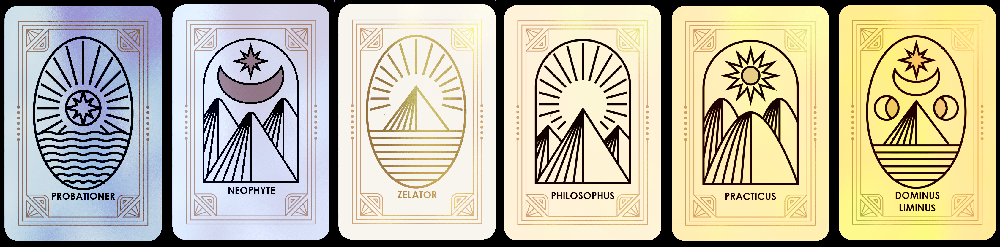

# 🪙 What is a Grade Token

Our Grade tokens, similar to "node tokens" are a token where people who create "nodes" : lock their KIN in a Grade token forever.

In exchange, they get perpetual yield through virtual (DaaS, DeFi-as-a-service) or real nodes (NaaS, Node-as-a-Service). The generated yield mostly varies from 1%-10% per day.

The goal is to bring passive income to its holders through various means (grouped staking and farming mostly _but not limited to_) to help sustain the rate of emission. This helps expose its holders to various protocols without having to deal with network fees, swapping, bridging, staking or bonding. **The Order calls them Grade tokens as they are very different on the technical side from your regular Node tokens. However, it's conceptually similar to a DaaS.**

Grade tokens have the ability to be directly traded since they adhere to the ERC-721 standard. 15% commission goes back to the Treasury where we proceed continually to buying back and burning more KIN.
