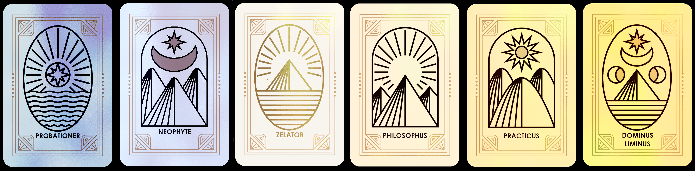

# What is a Node Token

Our Mebership cards, similar to "node tokens" are a token where people who create "nodes" : lock their tokens in it forever.&#x20;

In exchange, they get perpetual yield through virtual (DaaS, DeFi-as-a-service) or real nodes (NaaS, Node-as-a-Service). The generated yield mostly varies from 1%-10% per day. The goal is to bring passive income to its holders through various means (grouped staking and farming mostly _but not limited to_) to help sustain the rate of emission. This helps expose its holders to various protocols without to even having to deal with it. No network fees, swapping, bridging, staking or bonding are required.**The Order calls them "Cards" as they are very different on the technical side. However, it's conceptually similar to a DaaS.**

